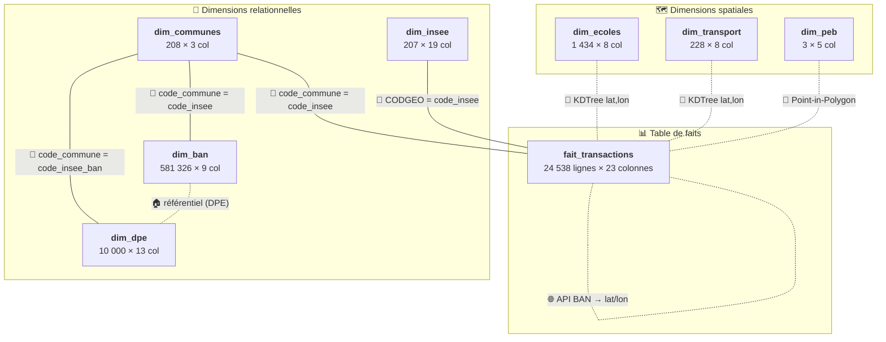
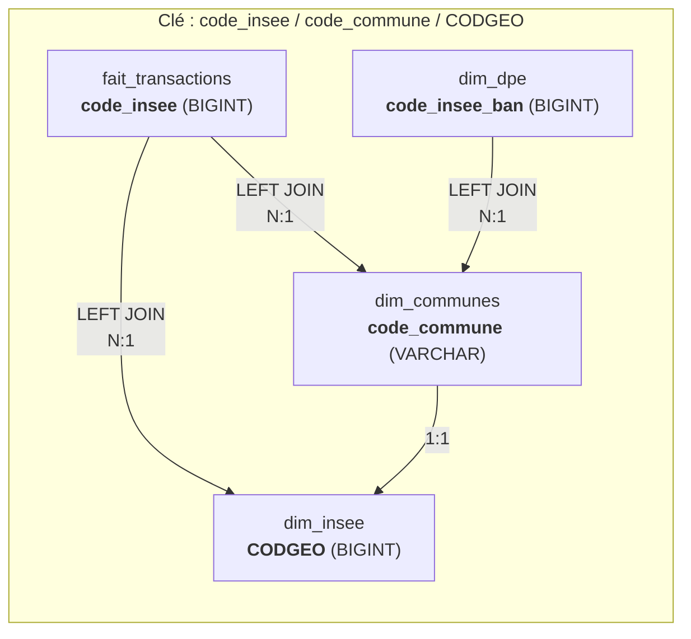

# Dictionnaire de Données — SAE-601 Nantes

> Documentation exhaustive de toutes les tables, colonnes, clés et jointures du schéma en étoile.

---

## Vue d'ensemble du schéma



**Légende des clés** :
- 🔑 **PK** = Clé primaire (identifiant unique de la ligne)
- 🔗 **FK** = Clé étrangère (référence vers une autre table)
- 📍 **SK** = Clé spatiale (jointure géographique pré-calculée en Python)

---

## 1. `fait_transactions` — Table de faits centrale

> Chaque ligne représente une **transaction immobilière** (vente) dans le département 44, enrichie avec des données DPE, INSEE, proximité écoles/transports et exposition au bruit.

| Source | Lignes | Colonnes |
|--------|--------|----------|
| `data/dvf/dvf_enriched_dept44.csv` (séparateur `;`) | 24 538 | 23 |

### Colonnes

| # | Colonne | Type DuckDB | Clé | Description | Exemple |
|---|---------|-------------|-----|-------------|---------|
| 1 | `id_mutation` | VARCHAR | — | Identifiant unique de la mutation DVF | `2025-00001` |
| 2 | `date_mutation` | VARCHAR | — | Date de la transaction immobilière | `2025-01-15` |
| 3 | `nature_mutation` | VARCHAR | — | Type de mutation (Vente, Adjudication…) | `Vente` |
| 4 | `prix` | DOUBLE | — | Prix de vente en euros (€) | `250000.0` |
| 5 | `type_bien` | VARCHAR | — | Type de bien vendu | `Appartement`, `Maison` |
| 6 | `surface` | DOUBLE | — | Surface réelle du bâti en m² | `75.0` |
| 7 | `pieces` | DOUBLE | — | Nombre de pièces principales | `3.0` |
| 8 | `prix_m2` | DOUBLE | — | Prix au mètre carré calculé (`prix / surface`) | `3333.33` |
| 9 | `adresse_normalisee` | VARCHAR | — | Adresse postale normalisée par la BAN | `12 Rue de la Paix` |
| 10 | `code_postal` | VARCHAR | — | Code postal du bien | `44000` |
| 11 | `nom_commune` | VARCHAR | — | Nom de la commune (majuscules) | `NANTES` |
| 12 | `code_insee` | BIGINT | 🔗 FK | Code INSEE de la commune → jointure vers `dim_communes`, `dim_insee` | `44109` |
| 13 | `lat` | DOUBLE | 📍 SK | Latitude WGS84 du bien (géocodage BAN) | `47.2184` |
| 14 | `lon` | DOUBLE | 📍 SK | Longitude WGS84 du bien (géocodage BAN) | `-1.5536` |
| 15 | `dpe_classe` | VARCHAR | — | Étiquette DPE du bien (performance énergétique) | `A` à `G` |
| 16 | `ges_classe` | VARCHAR | — | Étiquette GES du bien (émissions de gaz à effet de serre) | `A` à `G` |
| 17 | `annee_construction` | DOUBLE | — | Année de construction du bâtiment | `1975.0` |
| 18 | `insee_mediane_revenu` | BIGINT | — | Revenu médian de la commune en € (dénormalisé depuis `dim_insee.Q221`) | `24380` |
| 19 | `distance_ecole_m` | VARCHAR | 📍 SK | Distance en mètres à l'école la plus proche (calculée par KDTree) | `350.2` |
| 20 | `nom_ecole_proche` | VARCHAR | 📍 SK | Nom de l'école la plus proche | `École Jules Verne` |
| 21 | `distance_transport_m` | VARCHAR | 📍 SK | Distance en mètres à la station de transport la plus proche | `120.5` |
| 22 | `nom_transport_proche` | VARCHAR | 📍 SK | Nom de la station de transport la plus proche | `Commerce` |
| 23 | `exposition_aeroport_peb` | VARCHAR | 📍 SK | Zone de bruit PEB si le bien est dans un périmètre aéroportuaire | `Hors zone de bruit`, `Zone C` |

### Index

| Nom | Colonnes | Usage |
|-----|----------|-------|
| `idx_ft_code_insee` | `code_insee` | Jointures vers `dim_communes` et `dim_insee` |
| `idx_ft_type_bien` | `type_bien` | Filtres par type de bien |
| `idx_ft_dpe` | `dpe_classe` | Filtres par étiquette DPE |
| `idx_ft_date` | `date_mutation` | Filtres et tris chronologiques |
| `idx_ft_coords` | `lat, lon` | Requêtes spatiales |

---

## 2. `dim_communes` — Dimension géographique

> Référentiel des **208 communes** du département Loire-Atlantique (44). Contient le nom officiel et la géométrie GeoJSON pour la cartographie.

| Source | Lignes | Colonnes |
|--------|--------|----------|
| `data/admin/communes-44.geojson` (chargé via Python) | 208 | 3 |

### Colonnes

| # | Colonne | Type DuckDB | Clé | Description | Exemple |
|---|---------|-------------|-----|-------------|---------|
| 1 | `code_commune` | VARCHAR(5) | 🔑 PK | Code INSEE de la commune (identifiant unique) | `44109` |
| 2 | `nom` | VARCHAR(255) | — | Nom officiel de la commune | `Nantes` |
| 3 | `geometrie_json` | TEXT | — | Géométrie GeoJSON complète de la commune (MultiPolygon ou Polygon) | `{"type":"MultiPolygon","coordinates":[...]}` |

### Index

| Nom | Colonnes | Usage |
|-----|----------|-------|
| `idx_dim_communes_code` | `code_commune` | Jointures depuis `fait_transactions` et `dim_dpe` |

### Jointures impliquées

| Clé locale | → Table cible | Clé distante | Cardinalité | Description |
|------------|---------------|--------------|-------------|-------------|
| `code_commune` | `fait_transactions` | `code_insee` | 1 commune → N transactions | Une commune contient plusieurs ventes |
| `code_commune` | `dim_ban` | `code_insee` | 1 commune → N adresses | Une commune contient des milliers d'adresses BAN |
| `code_commune` | `dim_dpe` | `code_insee_ban` | 1 commune → N diagnostics | Une commune contient plusieurs DPE |
| `code_commune` | `dim_insee` | `CODGEO` | 1 commune → 1 jeu INSEE | Relation 1:1 avec les indicateurs socio-économiques |

---

## 3. `dim_ban` — Dimension adresses (géocodage)

> **Base Adresse Nationale** — référentiel de **581 326 adresses** du département 44. Cette table est conservée pour l'intégrité globale du schéma (notamment comme référentiel pour les DPE). Le **géocodage** des transactions DVF est, quant à lui, effectué directement en amont via l'API BAN en Python (99.8% de succès).

| Source | Lignes | Colonnes | Colonnes source originales |
|--------|--------|----------|---------------------------|
| `data/ban/adresses-44.csv` (séparateur `;`) | 581 326 | 9 | 23 (réduit à 9 utiles) |

### Colonnes

| # | Colonne | Type DuckDB | Clé | Description | Exemple |
|---|---------|-------------|-----|-------------|---------|
| 1 | `id_ban` | VARCHAR | 🔑 PK | Identifiant unique BAN de l'adresse | `44109_0590_00012` |
| 2 | `numero` | BIGINT | — | Numéro dans la voie | `12` |
| 3 | `rep` | VARCHAR | — | Indice de répétition (bis, ter, A, B…) | `bis` |
| 4 | `nom_voie` | VARCHAR | — | Nom de la voie | `Rue de la Paix` |
| 5 | `code_postal` | VARCHAR | — | Code postal | `44000` |
| 6 | `code_insee` | VARCHAR | 🔗 FK | Code INSEE de la commune → jointure vers `dim_communes` | `44109` |
| 7 | `nom_commune` | VARCHAR | — | Nom de la commune | `Nantes` |
| 8 | `lon` | DOUBLE | 📍 | Longitude WGS84 | `-1.5536` |
| 9 | `lat` | DOUBLE | 📍 | Latitude WGS84 | `47.2184` |

### Index

| Nom | Colonnes | Usage |
|-----|----------|-------|
| `idx_dim_ban_code_insee` | `code_insee` | Jointure vers `dim_communes`, filtrage par commune |
| `idx_dim_ban_code_postal` | `code_postal` | Filtrage par code postal |
| `idx_dim_ban_coords` | `lat, lon` | Recherche spatiale |
| `idx_dim_ban_voie` | `nom_voie` | Recherche par nom de voie (géocodage) |

### Rôle dans le pipeline de géocodage

```
DVF brut (adresse textuelle)          API BAN (En Ligne - batch)
┌──────────────────────┐              ┌───────────────────────┐
│ 12 Rue de la Paix    │ ─requête HTTP► │ 12, Rue de la Paix    │
│ 44000 Nantes         │ ◄──réponse──── │ 44000, Nantes         │
│ (pas de lat/lon)     │              │ lat=47.218, lon=-1.553│
└──────────────────────┘              └───────────────────────┘
                                              │
                                              ▼
                                     fait_transactions
                                     lat=47.218, lon=-1.553
                                              │
                               ┌──────────────┼──────────────┐
                               ▼              ▼              ▼
                         dim_ecoles    dim_transport     dim_peb
                        (KDTree)       (KDTree)      (Point-in-Poly)
```

### Jointures impliquées

| Clé locale | → Table cible | Clé distante | Cardinalité | Description |
|------------|---------------|--------------|-------------|-------------|
| `code_insee` | `dim_communes` | `code_commune` | N adresses → 1 commune | Chaque adresse appartient à une commune |
| Appariement externe | (API BAN) | `adresse_normalisee` | Géocodage natif | L'adresse de la transaction est géocodée via l'API en amont pour obtenir lat/lon |

---

## 4. `dim_insee` — Dimension socio-économique

> Indicateurs **FILO 2021** (Fichier Localisé social et fiscal) de l'INSEE. Un jeu de 19 indicateurs de revenus, inégalités et emploi **par commune**.

| Source | Lignes | Colonnes | Colonnes source originales |
|--------|--------|----------|---------------------------|
| `data/insee/insee_communes_44_2021.csv` (séparateur `;`) | 207 | 19 | ~1 020 (réduit à 19 utiles) |

### Colonnes

| # | Colonne | Type DuckDB | Clé | Description | Unité | Exemple |
|---|---------|-------------|-----|-------------|-------|---------|
| 1 | `CODGEO` | BIGINT | 🔑 PK | Code INSEE de la commune | — | `44109` |
| 2 | `NBMEN21` | BIGINT | — | Nombre de ménages fiscaux | Nb | `156000` |
| 3 | `NBPERS21` | BIGINT | — | Nombre de personnes dans les ménages fiscaux | Nb | `310000` |
| 4 | `NBUC21` | VARCHAR | — | Nombre d'unités de consommation | Nb | `220000` |
| 5 | `Q121` | VARCHAR | — | 1er quartile du revenu disponible par UC | € | `15200` |
| 6 | `Q221` | BIGINT | — | **Médiane** du revenu disponible par UC | € | `24380` |
| 7 | `Q321` | VARCHAR | — | 3e quartile du revenu disponible par UC | € | `35600` |
| 8 | `Q3_Q1` | VARCHAR | — | Rapport interquartile Q3/Q1 (mesure de dispersion) | Ratio | `2.3` |
| 9 | `RD` | VARCHAR | — | Rapport interdécile D9/D1 (mesure d'inégalité) | Ratio | `4.8` |
| 10 | `S80S2021` | VARCHAR | — | Rapport S80/S20 (rapport entre les 20% les plus riches et les 20% les plus pauvres) | Ratio | `5.2` |
| 11 | `GI21` | VARCHAR | — | **Indice de Gini** (0 = égalité parfaite, 1 = inégalité totale) | [0-1] | `0.412` |
| 12 | `PACT21` | VARCHAR | — | **Part des revenus d'activité** dans le revenu disponible | % | `68.5` |
| 13 | `PTSA21` | VARCHAR | — | Part des traitements et salaires | % | `60.2` |
| 14 | `PCHO21` | VARCHAR | — | **Part des indemnités de chômage** | % | `2.8` |
| 15 | `PBEN21` | VARCHAR | — | Part des revenus des indépendants (bénéfices) | % | `5.1` |
| 16 | `PPEN21` | VARCHAR | — | **Part des pensions, retraites et rentes** | % | `25.3` |
| 17 | `PAUT21` | VARCHAR | — | Part des autres revenus (patrimoine, etc.) | % | `6.2` |
| 18 | `PMIMP21` | VARCHAR | — | Part des ménages fiscaux imposés | % | `62.0` |
| 19 | `PIMPOT21` | VARCHAR | — | Part des impôts dans le revenu disponible | % | `15.8` |

### Index

| Nom | Colonnes | Usage |
|-----|----------|-------|
| `idx_dim_insee_codgeo` | `CODGEO` | Jointures depuis `fait_transactions` et `dim_communes` |

### Jointures impliquées

| Clé locale | → Table cible | Clé distante | Cardinalité | Description |
|------------|---------------|--------------|-------------|-------------|
| `CODGEO` | `fait_transactions` | `code_insee` | 1 jeu INSEE → N transactions | Enrichit chaque transaction avec le contexte socio-économique |
| `CODGEO` | `dim_communes` | `code_commune` | 1:1 | Chaque commune a exactement un jeu d'indicateurs |

---

## 5. `dim_dpe` — Dimension performance énergétique

> Diagnostics de Performance Énergétique (**DPE**) des logements existants du département 44. Chaque ligne est un DPE réalisé sur un logement.

| Source | Lignes | Colonnes | Colonnes source originales |
|--------|--------|----------|---------------------------|
| `data/dpe/dpe-logements-existants-44.csv` (séparateur `,`) | 10 000 | 13 | 226 (réduit à 13 utiles) |

### Colonnes

| # | Colonne | Type DuckDB | Clé | Description | Exemple |
|---|---------|-------------|-----|-------------|---------|
| 1 | `numero_dpe` | VARCHAR | 🔑 PK | Identifiant unique du diagnostic DPE | `2422E0123456789` |
| 2 | `etiquette_dpe` | VARCHAR | — | Classe énergétique du logement | `A`, `B`, `C`, `D`, `E`, `F`, `G` |
| 3 | `etiquette_ges` | VARCHAR | — | Classe d'émission de gaz à effet de serre | `A`, `B`, `C`, `D`, `E`, `F`, `G` |
| 4 | `type_batiment` | VARCHAR | — | Type de bâtiment diagnostiqué | `appartement`, `maison`, `immeuble` |
| 5 | `annee_construction` | BIGINT | — | Année de construction du bâtiment | `1975` |
| 6 | `surface_habitable_logement` | DOUBLE | — | Surface habitable en m² | `72.5` |
| 7 | `conso_5_usages_par_m2_ep` | DOUBLE | — | Consommation d'énergie primaire pour 5 usages (chauffage, ECS, refroidissement, éclairage, auxiliaires) rapportée au m² | `185.3` kWh/m²/an |
| 8 | `emission_ges_par_m2` | DOUBLE | — | Émissions de GES rapportées au m² | `32.1` kgCO₂/m²/an |
| 9 | `code_insee_ban` | BIGINT | 🔗 FK | Code INSEE de la commune (via géocodage BAN) → jointure vers `dim_communes` | `44109` |
| 10 | `nom_commune_ban` | VARCHAR | — | Nom de la commune (via géocodage BAN) | `Nantes` |
| 11 | `code_postal_ban` | BIGINT | — | Code postal (via géocodage BAN) | `44000` |
| 12 | `x_ban` | DOUBLE | — | Coordonnée X cartographique (Lambert 93) | `355687.2` |
| 13 | `y_ban` | DOUBLE | — | Coordonnée Y cartographique (Lambert 93) | `6689012.4` |

### Index

| Nom | Colonnes | Usage |
|-----|----------|-------|
| `idx_dim_dpe_etiquette` | `etiquette_dpe` | Filtres par classe énergétique |
| `idx_dim_dpe_code_insee` | `code_insee_ban` | Jointures vers `dim_communes` |
| `idx_dim_dpe_commune` | `nom_commune_ban` | Recherches par nom de commune |

### Jointures impliquées

| Clé locale | → Table cible | Clé distante | Cardinalité | Description |
|------------|---------------|--------------|-------------|-------------|
| `code_insee_ban` | `dim_communes` | `code_commune` | N diagnostics → 1 commune | Rattache chaque DPE à sa commune |

> **Note** : `dim_dpe` n'est **pas directement jointe** à `fait_transactions`. La classe DPE d'une transaction (`fait_transactions.dpe_classe`) est pré-calculée lors de l'enrichissement Python par appariement adresse/proximité. `dim_dpe` sert principalement pour la vue `vue_dpe_commune` (statistiques DPE agrégées par commune).

---

## 6. `dim_ecoles` — Dimension écoles

> Écoles du département 44 extraites d'**OpenStreetMap** via l'API Overpass. Utilisée pour le calcul de distance au plus proche voisin.

| Source | Lignes | Colonnes |
|--------|--------|----------|
| `data/ecoles/ecoles-44.csv` (séparateur `;`) | 1 434 | 8 |

### Colonnes

| # | Colonne | Type DuckDB | Clé | Description | Exemple attendu |
|---|---------|-------------|-----|-------------|-----------------|
| 1 | `osm_id` | VARCHAR | 🔑 PK | Identifiant OpenStreetMap du nœud/way | `123456789` |
| 2 | `type` | VARCHAR | — | Type d'élément OSM (node, way, relation) | `node` |
| 3 | `lat` | VARCHAR | 📍 SK | Latitude WGS84 | `47.2184` |
| 4 | `lon` | VARCHAR | 📍 SK | Longitude WGS84 | `-1.5536` |
| 5 | `name` | VARCHAR | — | Nom de l'école | `École Jules Verne` |
| 6 | `city` | VARCHAR | — | Ville de l'école | `Nantes` |
| 7 | `postcode` | VARCHAR | — | Code postal | `44000` |
| 8 | `amenity` | VARCHAR | — | Tag OSM de l'équipement | `school`, `kindergarten` |

### Index

| Nom | Colonnes | Usage |
|-----|----------|-------|
| `idx_dim_ecoles_coords` | `lat, lon` | Calcul KDTree de proximité |

### Jointure spatiale avec `fait_transactions`

| Type | Méthode | Résultat dans fait_transactions |
|------|---------|---------------------------------|
| 📍 Plus proche voisin | KDTree (scipy) en Python sur `(lat, lon)` | `distance_ecole_m` + `nom_ecole_proche` |

> Les distances calculées (`distance_ecole_m`) et le nom de l'école (`nom_ecole_proche`) sont pré-calculés et injectés dans `fait_transactions`.

---

## 7. `dim_transport` — Dimension transports

> Gares et stations de transport du département 44 extraites d'**OpenStreetMap** via l'API Overpass. Utilisée pour le calcul de distance au plus proche voisin.

| Source | Lignes | Colonnes |
|--------|--------|----------|
| `data/transport/stations-44.csv` (séparateur `;`) | 228 | 8 |

### Colonnes

| # | Colonne | Type DuckDB | Clé | Description | Exemple attendu |
|---|---------|-------------|-----|-------------|-----------------|
| 1 | `osm_id` | VARCHAR | 🔑 PK | Identifiant OpenStreetMap | `987654321` |
| 2 | `lat` | VARCHAR | 📍 SK | Latitude WGS84 | `47.2173` |
| 3 | `lon` | VARCHAR | 📍 SK | Longitude WGS84 | `-1.5419` |
| 4 | `name` | VARCHAR | — | Nom de la station/gare | `Commerce` |
| 5 | `railway_type` | VARCHAR | — | Type de transport ferroviaire | `station`, `halt`, `tram_stop` |
| 6 | `operator` | VARCHAR | — | Opérateur de transport | `SNCF`, `Semitan` |
| 7 | `network` | VARCHAR | — | Réseau de transport | `TER Pays de la Loire`, `TAN` |
| 8 | `uic_ref` | VARCHAR | — | Code UIC international de la gare | `8727100` |

### Index

| Nom | Colonnes | Usage |
|-----|----------|-------|
| `idx_dim_transport_coords` | `lat, lon` | Calcul KDTree de proximité |

### Jointure spatiale avec `fait_transactions`

| Type | Méthode | Résultat dans fait_transactions |
|------|---------|---------------------------------|
| 📍 Plus proche voisin | KDTree (scipy) en Python sur `(lat, lon)` | `distance_transport_m` + `nom_transport_proche` |

> Comme pour les écoles, les résultats (distance et nom) sont intégrés dans `fait_transactions`.

---

## 8. `dim_peb` — Dimension zones de bruit

> **Plans d'Exposition au Bruit** (PEB) — servitudes aéronautiques de dégagement pour les aérodromes du département 44. Chaque ligne est une zone de bruit autour d'un aérodrome.

| Source | Lignes | Colonnes | Colonnes source originales |
|--------|--------|----------|---------------------------|
| `data/peb/peb-44.csv` (séparateur `;`) + `data/peb/peb-44.geojson` | 3 | 5 | 22 (réduit à 5 utiles) |

### Colonnes

| # | Colonne | Type DuckDB | Clé | Description | Exemple |
|---|---------|-------------|-----|-------------|---------|
| 1 | `gid` | BIGINT | 🔑 PK | Identifiant unique de la servitude | `1523581` |
| 2 | `categorie` | VARCHAR | — | Catégorie de servitude (toujours T5 = aéronautique) | `T5` |
| 3 | `nomsup` | VARCHAR | — | Nom de la servitude / aérodrome | `T5_NANTES_ATLANTIQUE_sup` |
| 4 | `descriptio` | VARCHAR | — | Description textuelle de la servitude | `Servitude aéronautique de dégagement pour la protection de l'aérodrome de NANTES_ATLANTIQUE` |
| 5 | `geometrie_json` | VARCHAR | — | Géométrie GeoJSON du périmètre de bruit (ajoutée via Python depuis le GeoJSON) | `{"type":"MultiPolygon","coordinates":[...]}` |

### Les 3 zones PEB du département 44

| gid | Aérodrome | Servitude |
|-----|-----------|-----------|
| 1523581 | Nantes-Atlantique | Dégagement aéronautique |
| 1523582 | Ancenis | Dégagement aéronautique |
| 1523583 | Saint-Nazaire-Montoir | Dégagement aéronautique |

### Index

| Nom | Colonnes | Usage |
|-----|----------|-------|
| `idx_dim_peb_gid` | `gid` | Recherche par identifiant |
| `idx_dim_peb_categorie` | `categorie` | Filtres par catégorie |

### Jointure spatiale avec `fait_transactions`

| Type | Méthode | Résultat dans fait_transactions |
|------|---------|---------------------------------|
| 📍 Point-in-Polygon | Shapely (Python) — test si `(lat, lon)` de la transaction est dans le polygone PEB | `exposition_aeroport_peb` |

---

## Carte complète des jointures

### Jointures relationnelles (SQL)



| Jointure | SQL | Type | Note |
|----------|-----|------|------|
| Transactions → Communes | `fait_transactions.code_insee = dim_communes.code_commune` | LEFT JOIN (N:1) | Cast implicite BIGINT↔VARCHAR par DuckDB |
| Transactions → INSEE | `fait_transactions.code_insee = dim_insee.CODGEO` | LEFT JOIN (N:1) | Même type BIGINT |
| BAN → Communes | `dim_ban.code_insee = dim_communes.code_commune` | LEFT JOIN (N:1) | Rattache chaque adresse à sa commune |
| DPE → Communes | `dim_dpe.code_insee_ban = dim_communes.code_commune` | LEFT JOIN (N:1) | Cast implicite BIGINT↔VARCHAR par DuckDB |
| Communes ↔ INSEE | `dim_communes.code_commune = dim_insee.CODGEO` | 1:1 | Transitive, pas jointe directement |
| BAN → Transactions | Appariement adresse textuelle (Python) | Géocodage | Fournit les lat/lon aux transactions |

### Jointures spatiales (Python, pré-calculées)

| Jointure | Algorithme | Input | Output dans `fait_transactions` |
|----------|-----------|-------|----------------------------------|
| Transactions → Écoles | KDTree (scipy) sur `(lat, lon)` | `dim_ecoles.lat, lon` + `fait_transactions.lat, lon` | `distance_ecole_m`, `nom_ecole_proche` |
| Transactions → Transport | KDTree (scipy) sur `(lat, lon)` | `dim_transport.lat, lon` + `fait_transactions.lat, lon` | `distance_transport_m`, `nom_transport_proche` |
| Transactions → PEB | Point-in-Polygon (Shapely) | `dim_peb.geometrie_json` + `fait_transactions.lat, lon` | `exposition_aeroport_peb` |

### Dénormalisation intentionnelle

Certaines données de dimension sont **copiées directement** dans `fait_transactions` pour éviter des jointures à chaque requête :

| Colonne dans `fait_transactions` | Source réelle | Table dimension | Pourquoi dénormalisé ? |
|----------------------------------|---------------|-----------------|------------------------|
| `insee_mediane_revenu` | `Q221` | `dim_insee` | Évite un JOIN pour la mesure la plus fréquemment utilisée |
| `lat` | Géocodage API | `API BAN` | Résultat de la requête à l'API BAN |
| `lon` | Géocodage API | `API BAN` | Idem |
| `distance_ecole_m` | Calcul KDTree | `dim_ecoles` | Jointure spatiale non faisable en SQL standard |
| `nom_ecole_proche` | `name` | `dim_ecoles` | Idem |
| `distance_transport_m` | Calcul KDTree | `dim_transport` | Idem |
| `nom_transport_proche` | `name` | `dim_transport` | Idem |
| `exposition_aeroport_peb` | Test Point-in-Polygon | `dim_peb` | Idem |
| `dpe_classe` | Appariement adresse | `dim_dpe` | Appariement flou par adresse, non reproductible en SQL |
| `ges_classe` | Appariement adresse | `dim_dpe` | Idem |

---

## Vues et leurs parcours de jointures

### `vue_dvf_complet`

> Transaction enrichie avec le nom officiel de la commune et 5 indicateurs INSEE.

```sql
FROM fait_transactions ft                          -- 24 538 lignes
LEFT JOIN dim_communes c   ON ft.code_insee = c.code_commune   -- +nom commune
LEFT JOIN dim_insee i      ON ft.code_insee = i.CODGEO         -- +revenus, Gini
```

| Colonne ajoutée | Source | Description |
|-----------------|--------|-------------|
| `nom_commune_officiel` | `dim_communes.nom` | Nom officiel vs nom en majuscules de DVF |
| `revenu_median_2021` | `dim_insee.Q221` | Médiane du revenu disponible par UC |
| `indice_gini_2021` | `dim_insee.GI21` | Indice de Gini |
| `part_activite_2021` | `dim_insee.PACT21` | Part des revenus d'activité |
| `part_pensions_2021` | `dim_insee.PPEN21` | Part des pensions |
| `part_chomage_2021` | `dim_insee.PCHO21` | Part des indemnités de chômage |

---

### `vue_stats_commune`

> Statistiques agrégées par commune (GROUP BY).

```sql
FROM dim_communes c                                            -- 208 communes
LEFT JOIN fait_transactions ft ON c.code_commune = ft.code_insee
LEFT JOIN dim_insee i          ON c.code_commune = i.CODGEO
GROUP BY c.code_commune, c.nom, i.Q221, i.GI21
```

| Colonne produite | Agrégation | Description |
|------------------|------------|-------------|
| `nb_transactions` | `COUNT(ft.rowid)` | Nombre total de ventes dans la commune |
| `prix_moyen` | `AVG(ft.prix)` | Prix moyen en € |
| `prix_median` | `MEDIAN(ft.prix)` | Prix médian en € |
| `prix_m2_moyen` | `AVG(ft.prix_m2)` | Prix moyen au m² |
| `surface_moyenne` | `AVG(ft.surface)` | Surface moyenne en m² |
| `pieces_moyennes` | `AVG(ft.pieces)` | Nombre moyen de pièces |
| `nb_dpe_ab` | `COUNT(CASE WHEN dpe_classe IN ('A','B'))` | Nb de biens classe A ou B |
| `nb_dpe_fg` | `COUNT(CASE WHEN dpe_classe IN ('F','G'))` | Nb de biens classe F ou G (passoires) |

---

### `vue_dpe_commune`

> Répartition des étiquettes DPE par commune.

```sql
FROM dim_dpe                                                    -- 10 000 DPE
WHERE etiquette_dpe IS NOT NULL
GROUP BY code_insee_ban, nom_commune_ban, etiquette_dpe
```

| Colonne produite | Agrégation | Description |
|------------------|------------|-------------|
| `code_commune` | — | Code INSEE de la commune |
| `commune` | — | Nom de la commune |
| `etiquette_dpe` | — | Classe DPE (A à G) |
| `nombre_logements` | `COUNT(*)` | Nb de logements dans cette classe |
| `conso_moyenne_m2` | `AVG(conso_5_usages_par_m2_ep)` | Consommation moyenne en kWh/m²/an |

---

### `vue_proximites`

> Sélection des transactions géocodées avec leurs indicateurs de proximité.

```sql
FROM fait_transactions ft                                      -- filtre sur géocodé
WHERE ft.lat IS NOT NULL AND ft.lon IS NOT NULL
```

Pas de jointure — simple projection/filtre sur `fait_transactions`.
