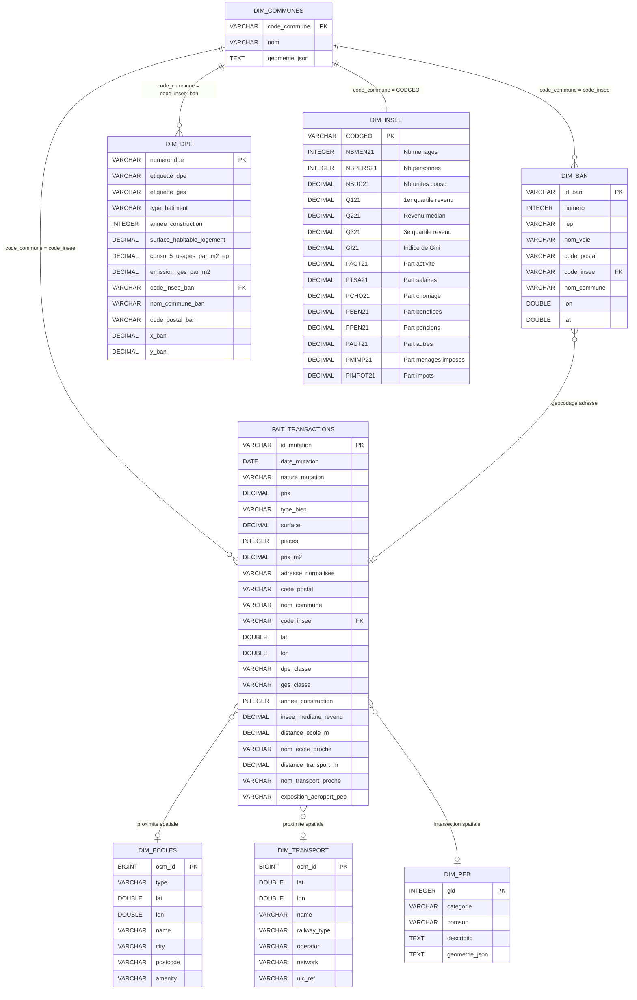
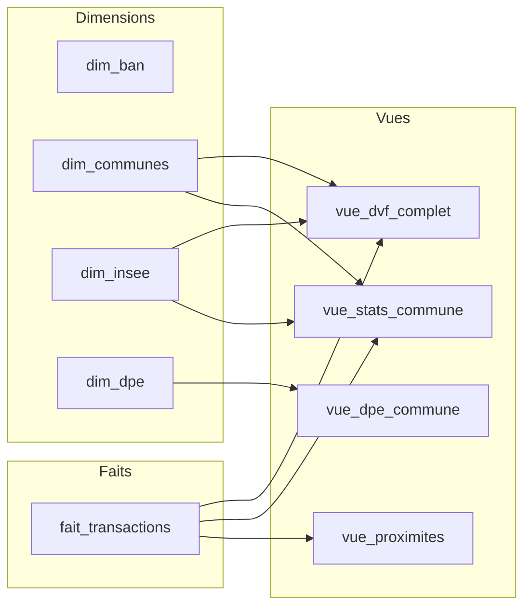

# Modèle Conceptuel de Données — SAE-601 Nantes

## Schéma en étoile

## Vues relationnelles

## Description des vues

| Vue | Description | Jointures |
|-----|-------------|-----------|
| `vue_dvf_complet` | Chaque transaction enrichie du nom commune officiel et des indicateurs INSEE (revenu médian, Gini, parts de revenus) | `fait_transactions` ← `dim_communes` ← `dim_insee` |
| `vue_stats_commune` | Statistiques agrégées par commune : prix moyen/médian, surface moyenne, répartition DPE A-B vs F-G | `dim_communes` ← `fait_transactions` ← `dim_insee` |
| `vue_dpe_commune` | Répartition des étiquettes DPE par commune avec consommation moyenne au m² | `dim_dpe` groupé par commune |
| `vue_proximites` | Distances aux écoles, transports et exposition PEB pour chaque transaction géocodée | `fait_transactions` filtré sur `lat IS NOT NULL` |

## Types de relations

| Relation | Type | Clé de jointure | Description |
|----------|------|-----------------|-------------|
| dim_communes → dim_ban | 1:N | `code_commune` = `code_insee` | Chaque commune contient des milliers d'adresses BAN |
| dim_communes → fait_transactions | 1:N | `code_commune` = `code_insee` | Chaque commune contient plusieurs transactions |
| dim_communes → dim_dpe | 1:N | `code_commune` = `code_insee_ban` | Chaque commune contient plusieurs diagnostics |
| dim_communes → dim_insee | 1:1 | `code_commune` = `CODGEO` | Un jeu d'indicateurs par commune |
| dim_ban → fait_transactions | Géocodage | Appariement adresse textuelle | L'adresse DVF est cherchée dans la BAN pour obtenir lat/lon |
| fait_transactions ↔ dim_ecoles | Spatiale | KDTree (lat, lon) | Distance au point le plus proche |
| fait_transactions ↔ dim_transport | Spatiale | KDTree (lat, lon) | Distance au point le plus proche |
| fait_transactions ↔ dim_peb | Spatiale | Intersection polygone | Détection si la transaction est dans une zone PEB |
